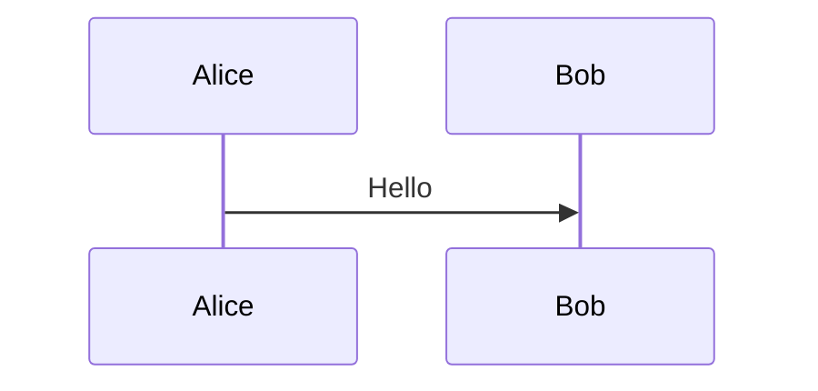

# Feature Brief: Source Renderers

## Status

Phases 1-5 shipped plus an Inline-zones enhancement that merges the
read-only "Inline" preview into the editable Code mode: when a file
has renderable regions, `MonacoCodeEditor` hosts view zones that
render each diagram inline after its last source line, alongside the
editable source. Markdown source Preview/Split also reuse the rendered
Markdown editing surface from Git diff, so rendered preview edits write
back to the same source buffer. Phase 6 (additional renderers beyond
Mermaid/math) planned.

This document defines a shared renderer model for source-backed previews. It
extends the Markdown document work into a more general capability: render
recognized diagrams, equations, and other safe visual blocks from the same
source buffer used by Monaco editing, Git diff edit mode, and rendered Markdown
views.

### Phase 1 shipped

- `remark-math` + `rehype-katex` + `katex` wired into
  `MarkdownContent` in `ui/src/message-cards.tsx`. Inline `$...$` and
  block `$$...$$` math render via KaTeX; rendered spans/divs carry
  `contentEditable={false}` and `data-markdown-serialization="skip"`
  so the rendered-Markdown diff editor's serializer (see
  `shouldSkipMarkdownEditableNode` in `ui/src/panels/DiffPanel.tsx`)
  preserves the source `$...$` / `$$...$$` literals and never captures
  KaTeX presentation HTML into the saved buffer.
- Per-document budget: `MAX_MATH_EXPRESSIONS_PER_DOCUMENT = 100`,
  pre-render counted by `countMathExpressions` (O(n) lexical scan
  mirroring `countMermaidMarkdownFences`). Over-budget documents
  still render the KaTeX output but route every math wrapper through
  `MathRenderBudgetFallback`, which stamps `math-render-skipped` and a
  `title` note. KaTeX itself is configured with `throwOnError: false`,
  `trust: false`, `strict: "ignore"`, `output: "html"` — a malformed
  expression renders as a red-colored error span instead of halting
  the whole Markdown render, and no arbitrary HTML can slip through
  `\href` / `\url`.
- Source line attributes (`data-markdown-line-start`) are attached to
  block math wrappers when `showLineNumbers` is on, feeding the
  existing Markdown line-gutter system.
- Eight Vitest cases in `ui/src/MarkdownContent.test.tsx` cover:
  inline-math wrapper shape, block-math wrapper shape, no interception
  of non-math span/div, malformed-expression resilience, exact-at-cap
  behavior, over-budget fallback, `$` in fenced code not being
  tokenized as math, and block-math line-attribute stamping.

### Phase 2 shipped

- `ui/src/source-renderers.ts` defines `SourceRenderContext`,
  `SourceRenderableRegion`, `detectRenderableRegions(context)`, and
  `hasRenderableRegions(context)`, plus the shared budget constants
  (`MAX_MERMAID_SOURCE_CHARS`, `MAX_MERMAID_DIAGRAMS_PER_DOCUMENT`,
  `MAX_MATH_EXPRESSIONS_PER_DOCUMENT`) that Source + Diff panels can
  read without depending on `message-cards.tsx`.
- Detectors cover Markdown files (Mermaid + math fences + inline
  `$...$` + same-line and multi-line `$$...$$`) and dedicated
  Mermaid files (`.mmd`, `.mermaid`). `message-cards.tsx`
  re-imports the shared helpers — no duplicate logic.
- 25 Vitest cases in `ui/src/source-renderers.test.ts` pin budget
  constants, fence predicates, counts, region detection for all
  four kinds, sort order, stable ids, the editable-mode flag, and
  dedicated-file-type handling.

### Phase 3 shipped

- `ui/src/panels/SourcePanel.tsx` exposes Preview/Split modes for
  any file the registry detects as renderable — not just Markdown.
  Dedicated Mermaid files get the mode switcher with a "Mermaid"
  chip.
- `RendererPreviewPane` routes Markdown through
  `MarkdownDocumentView` (unchanged chrome) and non-Markdown
  renderable files through `MarkdownContent` with a synthetic
  Markdown fragment composed from detected regions (per-region
  `Lines X–Y` headers + appropriate fence wrapping).
- Detection runs against the CURRENT edit buffer via `useMemo`, so
  the preview reflects unsaved edits.
- 3 Vitest cases cover `.mmd` file exposing Preview/Split, plain
  Rust file NOT exposing them, and edit-buffer re-detection.

### Phase 4 shipped

- `ui/src/panels/DiffPanel.tsx` gains a read-only `"rendered"` view
  mode for non-Markdown files whose after side has at least one
  renderable region. Reuses `MarkdownContent` for safe
  Mermaid/KaTeX rendering.
- Staged/unstaged side semantics preserved: reads
  `documentContent.after.content` (authoritative for the selected
  `GitDiffSection`), fallback to `latestFile.content` only when the
  backend didn't enrich.
- Patch-only fallback label when `documentContent.isCompleteDocument`
  is not set — points reviewers at the Raw patch view for
  authoritative review.
- Edits stay in Monaco's Edit mode (Phase 4 is display-only).
- 2 Vitest cases cover full-document `.mmd` render and patch-only
  fallback label.

### Phase 5 shipped

- Rust files (`.rs` extension or `language: "rust"`) are a
  recognized content kind. `detectRustRegions` parses the file into
  doc-comment blocks, strips the marker prefix, runs the existing
  Markdown fence + math detector against each block, and remaps the
  detected regions' line numbers back to the original Rust source
  via a per-block line-number table.
- Supported forms: `///`, `//!`, `/** ... */`, `/*! ... */`
  (single-line and multi-line). Rustdoc conventions honored —
  a single leading space after the marker is stripped; ` * `
  prefixes on multi-line block-doc bodies are stripped; `////` and
  plain `/* */` are NOT parsed.
- Source-line navigation: regions carry the original Rust line
  range so `Lines X–Y` labels in the Source/Diff preview cross-
  reference Monaco lines directly.
- 10 Vitest cases in `source-renderers.test.ts` cover: no-doc
  files, `///` with Mermaid, `//!` with math, multi-line `/** */`
  with Mermaid, rejection of `////`/`/* */`, prose-only doc blocks,
  multiple doc blocks in one file, `.rs` without explicit language,
  single-line `/** */`, and `editable: false` in diff mode. One
  additional SourcePanel integration test exercises the end-to-end
  Preview/Split exposure for Rust files with doc-comment Mermaid
  fences.

### Inline zones shipped (post-Phase-5 enhancement)

Diagrams now render in-place WITHIN the editable Code view, not just
in a separate Preview/Split pane. The earlier read-only "Inline"
mode was dropped — feedback was that mode toggles were friction
("separate modes are not that useful").

- `MonacoCodeEditor` gained an optional `inlineZones` prop:
  `Array<{ id, afterLineNumber, render }>`. The editor manages a
  view-zone registry keyed by zone id, using `changeViewZones` to
  add/remove/move zones in response to prop changes, and portals
  the caller's React output into each zone's DOM node.
- Stable zone ids (from the registry's `SourceRenderableRegion.id`)
  keep the portal DOM node mounted across keystrokes. A mid-edit
  fence change shifts the zone's `afterLineNumber` (triggering
  remove + re-add in Monaco, because the view-zone API has no
  "update position" primitive), but the diagram host DOM node
  survives — the Mermaid iframe doesn't re-initialize and the
  KaTeX output doesn't re-parse on every keystroke.
- Content-height tracking via `ResizeObserver`: each zone's DOM
  node is watched, and when the rendered diagram finishes
  async-rendering (or the fence body changes to produce a
  different-sized diagram), the zone is removed and re-added with
  the measured height. The brief flicker on first paint is the
  cost of Monaco's "fixed height" view-zone API.
- `SourcePanel` computes `inlineZones` via `useMemo` over
  `renderableRegions` and passes them to Monaco in both Code mode
  and Split mode's editor pane. Empty arrays for non-renderable
  files incur zero zone overhead.
- Three SourcePanel Vitest cases (via a textarea Monaco mock that
  surfaces `inlineZones.length` + `afterLineNumber` as data
  attributes): zones passed for a Rust file with a `///` Mermaid
  fence, zero zones for a plain Rust file, and live-recompute when
  the user types to grow the fence body (zone's `afterLineNumber`
  shifts from 3 to 4 as a line is added).

### Fit-to-frame Mermaid previews shipped

Source-preview surfaces enable `fillMermaidAvailableSpace` so rendered
Markdown can use the full preview column and Mermaid diagrams can fit the
available width. Default conversation/history Markdown keeps the older
scrollable Mermaid frame: wide diagrams preserve their intrinsic iframe width
when the column has room, and shrink with the iframe when `max-width: 100%`
constrains it so the aspect-ratio height does not clip the bottom of the SVG.
Source previews instead pass `fitToFrame: true` into the Mermaid iframe srcdoc
and frame-style helper.

Fit mode changes two things deliberately:

- The iframe srcdoc uses hidden overflow, a block body, and
  `svg { max-width: 100%; height: auto; }`, so wide diagrams shrink to the
  pane instead of requiring horizontal iframe scrolling.
- The outer iframe aspect ratio drops the default 24px scrollbar slack and
  keeps only a 2px vertical pad matching the existing width pad. That avoids
  the old blank band under fitted diagrams while still guarding against
  hidden-overflow clipping from rounding and SVG measurement drift.

This mode is preview-wide rather than Mermaid-only: enabling it also applies
`markdown-copy-shell-fill-mermaid`, widening the Markdown copy shell around
the diagram so the iframe can actually consume the preview pane width.

## Problem

TermAl already uses Monaco as the source editor. That is the right editing
surface, but many source files contain content that is easier to understand as
rendered output:

- Markdown files with Mermaid diagrams or math equations.
- Rust doc comments that contain fenced Mermaid or math blocks.
- Dedicated diagram files such as `.mmd` or `.mermaid`.
- Future tagged blocks such as Graphviz, PlantUML, charts, or richer Markdown
  extensions.

The current Markdown document spec covers Markdown files and Markdown Git diffs,
but it does not define a reusable model for renderers that work across:

- regular source edit preview;
- split source editing;
- Git diff preview;
- Git diff edit mode;
- rendered Markdown diff edit;
- non-Markdown source languages such as Rust.

## Goals

- Keep Monaco as the only full source editor.
- Add safe rendered previews for recognized source regions when the user is not
  directly editing that rendered output.
- Reuse the same renderer registry in source files, Markdown files, and diff
  views.
- Support Mermaid and math as the first renderer families.
- Support Markdown fenced blocks and Rust doc-comment fenced blocks first.
- Preserve Git staged/unstaged semantics exactly in diff views.
- Keep generated visuals out of saved source serialization.
- Provide source line mapping so rendered blocks can open/focus the underlying
  source line.

## Non-goals

- No WYSIWYG editor for arbitrary source languages.
- No execution of code blocks.
- No notebook runtime.
- No automatic rendering of arbitrary string literals.
- No full rustdoc clone in v1.
- No rendering of untagged comments as diagrams or equations.
- No external network fetches from renderers.

## Product Model

There are two separate surfaces:

1. **Source editing surface**: Monaco owns the source text, undo stack,
   selection, save behavior, stale-file checks, and conflict handling.
2. **Rendered preview surface**: TermAl renders safe generated output from the
   current source text or selected Git side.

The rendered preview is always derived from source. It is not the source of
truth.

## Renderer Targets

### Markdown Files

Markdown files continue to use the `MarkdownDocumentView` path.

Supported renderable blocks:

````markdown

````

```markdown
Inline math: $E = mc^2$

Block math:

$$
\int_0^1 x^2 dx = \frac{1}{3}
$$
```

Optional fenced math syntax:

````markdown
```math
E = mc^2
```
````

### Rust Source Files

Rust support should start with doc comments because they already use Markdown
semantics.

Supported forms:

````rust
/// Architecture sketch:
///
/// ```mermaid
/// sequenceDiagram
///   UI->>Backend: POST /api/git/diff
///   Backend-->>UI: documentContent
/// ```
pub fn example() {}
````

````rust
//! Module invariant:
//!
//! ```math
//! revision_{n+1} = revision_n + 1
//! ```
````

Rules:

- Only Rust doc comments are parsed for v1: `///`, `//!`, `/** ... */`, and
  `/*! ... */`.
- The renderer strips the Rust doc-comment marker and parses the remaining text
  as Markdown.
- Ordinary comments and string literals are not rendered in v1.
- Rendered regions keep source line anchors back to the original Rust file.

### Dedicated Diagram Or Equation Files

Dedicated file types can render the whole file:

| Extension | Initial Renderer |
| --- | --- |
| `.mmd`, `.mermaid` | Mermaid |
| `.tex`, `.latex` | Math preview, only when the file is a single equation or explicitly marked as previewable |

Dedicated support should be opt-in and conservative. For example, a full LaTeX
document is not the same as a single KaTeX equation.

## Source Panel Behavior

For files with renderable content, the source panel can expose:

- `Code`
- `Preview`
- `Split`

Rules:

- `Code` keeps the current Monaco editor.
- `Preview` renders from the current source buffer. For Markdown files,
  the rendered document is editable and commits back to that same buffer.
- `Split` shows Monaco and rendered preview side by side; Markdown
  rendered edits update the Monaco buffer on blur/save/mode changes.
- Preview updates from unsaved `editorValue`, not stale loaded file content.
- Save, reload, compare, rebase, and stale-write behavior remain source-buffer
  operations.
- The mode switcher should appear for Markdown files and for other files only
  when the renderer registry detects at least one renderable region.
- Scroll offset, cursor position, and undo history in Monaco must survive the
  remount / rehydrate cycle described in
  [Editor Buffer Persistence](./editor-buffer-persistence.md). Inline view
  zones complicate scroll restoration because the outer pixel height depends
  on an async-measured inner height — the persistence layer has to re-apply
  `scrollTop` after the first post-rehydrate view-zone measurement settles,
  otherwise the caret lands on the wrong rendered block.

## Diff Panel Behavior

Diff views must preserve the selected Git section semantics:

| Section | Rendered Source |
| --- | --- |
| `unstaged` | working tree after side |
| `staged` | index after side |
| untracked in `unstaged` | working tree file |
| added in `staged` | index file |

Rules:

- Never render the worktree as the staged after side unless the backend confirms
  that content is the index side.
- Patch-only previews must be labeled as incomplete.
- Deleted renderable regions are read-only historical content.
- Added or unchanged after-side renderable regions can be shown in the preview.
- For non-Markdown files, v1 should render a read-only region preview and keep
  source edits in `Edit` mode through Monaco.
- Diff edit preview renders the current edit buffer, not a stale Git side
  snapshot.

## Rendered Markdown Diff Editing

Rendered Markdown diff editing is special because it can edit Markdown sections
directly through `contentEditable`.

Renderer rules:

- Generated visuals such as Mermaid diagrams and KaTeX equations must be
  `contentEditable={false}`.
- Generated visuals must use `data-markdown-serialization="skip"` or an
  equivalent skip marker so saved source does not become generated HTML/SVG.
- When a renderer replaces source in the visual tree, the original source must
  remain recoverable for editing or serialization.
- If exact round-trip is not possible, the visual should be read-only and the
  user should edit the source side.

## Renderer Registry

Create a narrow renderer registry instead of scattering special cases through
panels.

```ts
type SourceRenderContext = {
  path: string | null;
  language: string | null;
  content: string;
  mode: "source" | "diff" | "diff-edit" | "markdown-diff";
};

type SourceRenderableRegion = {
  id: string;
  renderer: "markdown" | "mermaid" | "math";
  sourceStartLine: number;
  sourceEndLine: number;
  sourceText: string;
  displayText: string;
  editable: boolean;
};
```

Responsibilities:

- Detect renderable regions from path, language, and content.
- Preserve source line ranges.
- Apply budget limits before rendering.
- Return no regions for unsupported or ambiguous content.
- Keep renderer-specific logic outside `SourcePanel` and `DiffPanel`.

## Initial Renderer Families

### Mermaid

Use the existing Mermaid renderer path.

Rules:

- Render only tagged Mermaid blocks.
- Keep the current sandboxed iframe behavior.
- Size the iframe from the rendered SVG `viewBox` using a clamped width and
  CSS `aspect-ratio` with `height: auto`. The frame must preserve the diagram's
  aspect ratio when pane width constrains `max-width: 100%`; do not return to a
  fixed-height iframe, because wide ER diagrams otherwise scale down
  horizontally while retaining a tall blank frame. The iframe srcdoc must also
  let the inner SVG shrink with the constrained frame before vertical overflow
  is hidden, otherwise tall or wide diagrams can clip at the bottom.
- Keep source visible or recoverable in editable contexts.
- Keep existing source length and diagram count budgets.

### Math

Use KaTeX first unless a future use case requires MathJax.

Recommended dependencies:

- `remark-math`
- `rehype-katex`
- `katex`

Rules:

- Support Markdown inline math and block math.
- Support fenced `math`, `latex`, `tex`, or `katex` blocks if the implementation
  can keep round-trip semantics clean.
- Keep KaTeX `trust` disabled unless there is a specific reviewed need.
- Add source length and equation count budgets, similar to Mermaid.

## Safety

- Renderers must not execute arbitrary source code.
- Renderer HTML/SVG output must be sandboxed or sanitized.
- Renderer output must not make network requests unless explicitly allowed and
  documented.
- Unsafe links must keep using the existing URL policy.
- Rendering failures should show source fallback, not break the whole preview.
- Large or pathological inputs must degrade to source display with a note.

## Testing

Automated tests:

- Markdown source preview renders Mermaid from unsaved editor content.
- Markdown source Preview/Split rendered edits save through the same
  `editorValue` buffer as Code mode.
- Markdown source preview renders inline and block math.
- Markdown diff view renders Mermaid/math with correct staged and unstaged side
  semantics.
- Diff edit split preview renders from `editValue`.
- Rust doc comments with fenced Mermaid/math produce renderable regions with
  correct source line ranges.
- Ordinary Rust comments and string literals do not render as diagrams.
- Generated visuals are not included in rendered Markdown serialization.
- Mermaid/math budget limits fall back to source display with a visible note.
- Renderer detection does not show preview controls for files with no renderable
  regions.

Manual checks:

- README-style Markdown with diagrams, equations, tables, links, and images.
- Rust module docs with Mermaid and math fences.
- Staged Markdown file with additional unstaged changes in the same file.
- Unstaged Rust file with doc-comment renderer changes.
- Large Markdown file with many Mermaid/math blocks.

## Delivery Plan

### Phase 1: Math in Shared Markdown Renderer

- Add KaTeX dependencies.
- Add inline and block math support to `MarkdownContent`.
- Add tests for source Markdown preview, Markdown diff view, and rendered
  Markdown serialization skip behavior.

### Phase 2: Renderer Registry

- Add a small source renderer registry.
- Move Mermaid/math detection behind registry-style helpers.
- Add region metadata with source line ranges and budgets.

### Phase 3: Source Panel Integration

- Show `Preview` and `Split` for Markdown and detected renderable non-Markdown
  files.
- Render from unsaved `editorValue`.
- Reuse the rendered Markdown editor for Markdown source Preview/Split.
- Preserve current save/reload/rebase behavior.

### Phase 4: Diff Panel Integration

- Add renderer preview support for diff edit mode and non-Markdown renderable
  regions.
- Preserve staged/unstaged side semantics.
- Add patch-only fallback labeling.

### Phase 5: Rust Doc Comments

- Parse Rust doc comments into Markdown-like renderable regions.
- Render tagged Mermaid/math fences.
- Add source-line navigation from rendered block to Monaco.

### Phase 6: Additional Renderers

Consider additional renderers only after Mermaid and math are stable:

- Admonitions / alerts. These are the next pragmatic Markdown extension because they
  stay text-first, fit the existing rendered-Markdown editing model, and do not add a
  separate diagram runtime.
- D2 diagrams. Attractive for architecture-style docs, but they require an explicit
  dependency choice first: bundled wasm, local CLI/binary, or another local renderer.
  Do not ship D2 behind a network dependency.
- Graphviz/DOT.
- PlantUML, likely requiring a server-side or local binary decision.
- Vega-Lite or chart blocks. Lower dependency friction than D2 because they can run
  fully in-browser.
- JSON/schema visualizers.
