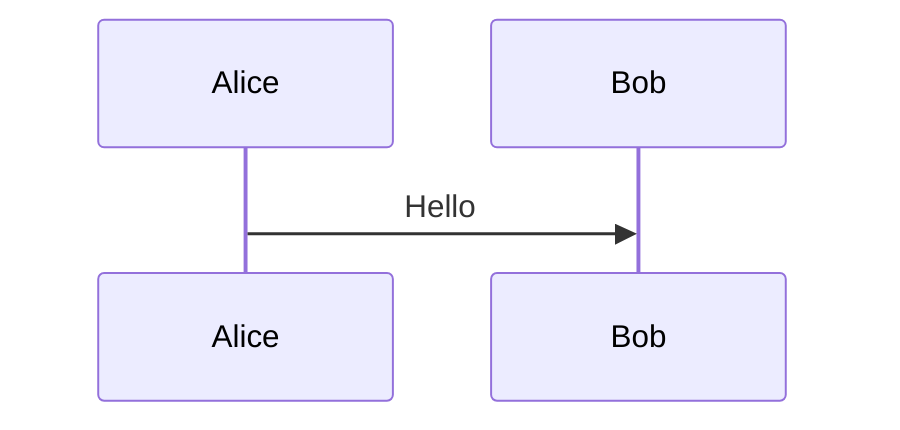

# Feature Brief: Source Renderers

## Status

Planned.

This document defines a shared renderer model for source-backed previews. It
extends the Markdown document work into a more general capability: render
recognized diagrams, equations, and other safe visual blocks from the same
source buffer used by Monaco editing, Git diff edit mode, and rendered Markdown
views.

## Problem

TermAl already uses Monaco as the source editor. That is the right editing
surface, but many source files contain content that is easier to understand as
rendered output:

- Markdown files with Mermaid diagrams or math equations.
- Rust doc comments that contain fenced Mermaid or math blocks.
- Dedicated diagram files such as `.mmd` or `.mermaid`.
- Future tagged blocks such as Graphviz, PlantUML, charts, or richer Markdown
  extensions.

The current Markdown document spec covers Markdown files and Markdown Git diffs,
but it does not define a reusable model for renderers that work across:

- regular source edit preview;
- split source editing;
- Git diff preview;
- Git diff edit mode;
- rendered Markdown diff edit;
- non-Markdown source languages such as Rust.

## Goals

- Keep Monaco as the only full source editor.
- Add safe rendered previews for recognized source regions when the user is not
  directly editing that rendered output.
- Reuse the same renderer registry in source files, Markdown files, and diff
  views.
- Support Mermaid and math as the first renderer families.
- Support Markdown fenced blocks and Rust doc-comment fenced blocks first.
- Preserve Git staged/unstaged semantics exactly in diff views.
- Keep generated visuals out of saved source serialization.
- Provide source line mapping so rendered blocks can open/focus the underlying
  source line.

## Non-goals

- No WYSIWYG editor for arbitrary source languages.
- No execution of code blocks.
- No notebook runtime.
- No automatic rendering of arbitrary string literals.
- No full rustdoc clone in v1.
- No rendering of untagged comments as diagrams or equations.
- No external network fetches from renderers.

## Product Model

There are two separate surfaces:

1. **Source editing surface**: Monaco owns the source text, undo stack,
   selection, save behavior, stale-file checks, and conflict handling.
2. **Rendered preview surface**: TermAl renders safe generated output from the
   current source text or selected Git side.

The rendered preview is always derived from source. It is not the source of
truth.

## Renderer Targets

### Markdown Files

Markdown files continue to use the `MarkdownDocumentView` path.

Supported renderable blocks:

````markdown

````

```markdown
Inline math: $E = mc^2$

Block math:

$$
\int_0^1 x^2 dx = \frac{1}{3}
$$
```

Optional fenced math syntax:

````markdown
```math
E = mc^2
```
````

### Rust Source Files

Rust support should start with doc comments because they already use Markdown
semantics.

Supported forms:

````rust
/// Architecture sketch:
///
/// ```mermaid
/// sequenceDiagram
///   UI->>Backend: POST /api/git/diff
///   Backend-->>UI: documentContent
/// ```
pub fn example() {}
````

````rust
//! Module invariant:
//!
//! ```math
//! revision_{n+1} = revision_n + 1
//! ```
````

Rules:

- Only Rust doc comments are parsed for v1: `///`, `//!`, `/** ... */`, and
  `/*! ... */`.
- The renderer strips the Rust doc-comment marker and parses the remaining text
  as Markdown.
- Ordinary comments and string literals are not rendered in v1.
- Rendered regions keep source line anchors back to the original Rust file.

### Dedicated Diagram Or Equation Files

Dedicated file types can render the whole file:

| Extension | Initial Renderer |
| --- | --- |
| `.mmd`, `.mermaid` | Mermaid |
| `.tex`, `.latex` | Math preview, only when the file is a single equation or explicitly marked as previewable |

Dedicated support should be opt-in and conservative. For example, a full LaTeX
document is not the same as a single KaTeX equation.

## Source Panel Behavior

For files with renderable content, the source panel can expose:

- `Code`
- `Preview`
- `Split`

Rules:

- `Code` keeps the current Monaco editor.
- `Preview` renders from the current source buffer.
- `Split` shows Monaco and rendered preview side by side.
- Preview updates from unsaved `editorValue`, not stale loaded file content.
- Save, reload, compare, rebase, and stale-write behavior remain source-buffer
  operations.
- The mode switcher should appear for Markdown files and for other files only
  when the renderer registry detects at least one renderable region.

## Diff Panel Behavior

Diff views must preserve the selected Git section semantics:

| Section | Rendered Source |
| --- | --- |
| `unstaged` | working tree after side |
| `staged` | index after side |
| untracked in `unstaged` | working tree file |
| added in `staged` | index file |

Rules:

- Never render the worktree as the staged after side unless the backend confirms
  that content is the index side.
- Patch-only previews must be labeled as incomplete.
- Deleted renderable regions are read-only historical content.
- Added or unchanged after-side renderable regions can be shown in the preview.
- For non-Markdown files, v1 should render a read-only region preview and keep
  source edits in `Edit` mode through Monaco.
- Diff edit preview renders the current edit buffer, not a stale Git side
  snapshot.

## Rendered Markdown Diff Editing

Rendered Markdown diff editing is special because it can edit Markdown sections
directly through `contentEditable`.

Renderer rules:

- Generated visuals such as Mermaid diagrams and KaTeX equations must be
  `contentEditable={false}`.
- Generated visuals must use `data-markdown-serialization="skip"` or an
  equivalent skip marker so saved source does not become generated HTML/SVG.
- When a renderer replaces source in the visual tree, the original source must
  remain recoverable for editing or serialization.
- If exact round-trip is not possible, the visual should be read-only and the
  user should edit the source side.

## Renderer Registry

Create a narrow renderer registry instead of scattering special cases through
panels.

```ts
type SourceRenderContext = {
  path: string | null;
  language: string | null;
  content: string;
  mode: "source" | "diff" | "diff-edit" | "markdown-diff";
};

type SourceRenderableRegion = {
  id: string;
  renderer: "markdown" | "mermaid" | "math";
  sourceStartLine: number;
  sourceEndLine: number;
  sourceText: string;
  displayText: string;
  editable: boolean;
};
```

Responsibilities:

- Detect renderable regions from path, language, and content.
- Preserve source line ranges.
- Apply budget limits before rendering.
- Return no regions for unsupported or ambiguous content.
- Keep renderer-specific logic outside `SourcePanel` and `DiffPanel`.

## Initial Renderer Families

### Mermaid

Use the existing Mermaid renderer path.

Rules:

- Render only tagged Mermaid blocks.
- Keep the current sandboxed iframe behavior.
- Keep source visible or recoverable in editable contexts.
- Keep existing source length and diagram count budgets.

### Math

Use KaTeX first unless a future use case requires MathJax.

Recommended dependencies:

- `remark-math`
- `rehype-katex`
- `katex`

Rules:

- Support Markdown inline math and block math.
- Support fenced `math`, `latex`, `tex`, or `katex` blocks if the implementation
  can keep round-trip semantics clean.
- Keep KaTeX `trust` disabled unless there is a specific reviewed need.
- Add source length and equation count budgets, similar to Mermaid.

## Safety

- Renderers must not execute arbitrary source code.
- Renderer HTML/SVG output must be sandboxed or sanitized.
- Renderer output must not make network requests unless explicitly allowed and
  documented.
- Unsafe links must keep using the existing URL policy.
- Rendering failures should show source fallback, not break the whole preview.
- Large or pathological inputs must degrade to source display with a note.

## Testing

Automated tests:

- Markdown source preview renders Mermaid from unsaved editor content.
- Markdown source preview renders inline and block math.
- Markdown diff view renders Mermaid/math with correct staged and unstaged side
  semantics.
- Diff edit split preview renders from `editValue`.
- Rust doc comments with fenced Mermaid/math produce renderable regions with
  correct source line ranges.
- Ordinary Rust comments and string literals do not render as diagrams.
- Generated visuals are not included in rendered Markdown serialization.
- Mermaid/math budget limits fall back to source display with a visible note.
- Renderer detection does not show preview controls for files with no renderable
  regions.

Manual checks:

- README-style Markdown with diagrams, equations, tables, links, and images.
- Rust module docs with Mermaid and math fences.
- Staged Markdown file with additional unstaged changes in the same file.
- Unstaged Rust file with doc-comment renderer changes.
- Large Markdown file with many Mermaid/math blocks.

## Delivery Plan

### Phase 1: Math in Shared Markdown Renderer

- Add KaTeX dependencies.
- Add inline and block math support to `MarkdownContent`.
- Add tests for source Markdown preview, Markdown diff view, and rendered
  Markdown serialization skip behavior.

### Phase 2: Renderer Registry

- Add a small source renderer registry.
- Move Mermaid/math detection behind registry-style helpers.
- Add region metadata with source line ranges and budgets.

### Phase 3: Source Panel Integration

- Show `Preview` and `Split` for Markdown and detected renderable non-Markdown
  files.
- Render from unsaved `editorValue`.
- Preserve current save/reload/rebase behavior.

### Phase 4: Diff Panel Integration

- Add renderer preview support for diff edit mode and non-Markdown renderable
  regions.
- Preserve staged/unstaged side semantics.
- Add patch-only fallback labeling.

### Phase 5: Rust Doc Comments

- Parse Rust doc comments into Markdown-like renderable regions.
- Render tagged Mermaid/math fences.
- Add source-line navigation from rendered block to Monaco.

### Phase 6: Additional Renderers

Consider additional renderers only after Mermaid and math are stable:

- Graphviz/DOT.
- PlantUML, likely requiring a server-side or local binary decision.
- Vega-Lite or chart blocks.
- JSON/schema visualizers.
