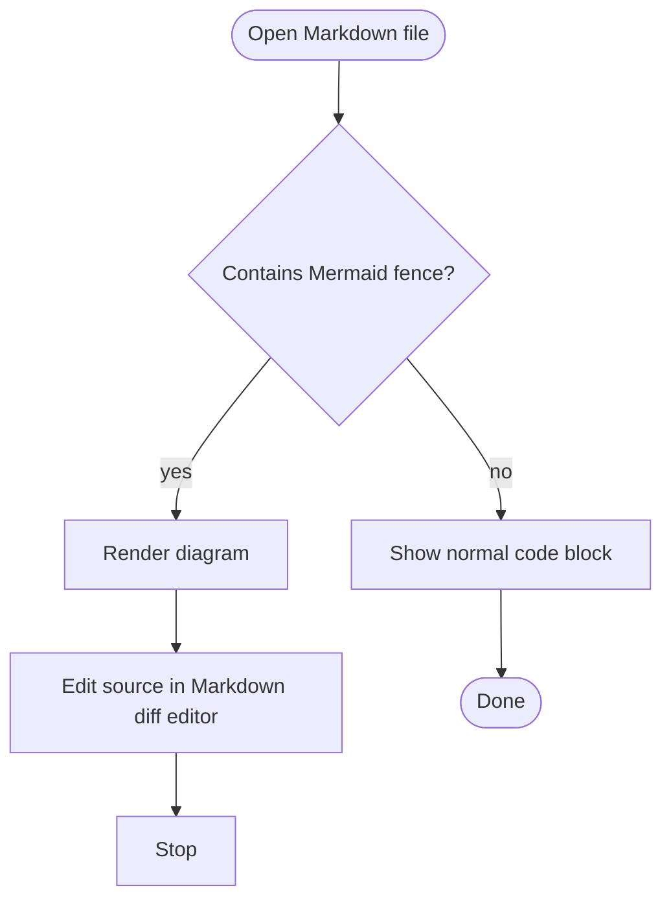

# Mermaid Demo

```mermaid
flowchart TD
  Start([Open Markdown file]) --> Detect{Contains Mermaid fence?}
  Detect -- yes --> Render[Render diagram]
  Detect -- no --> Code[Show normal code block]
  Render --> Edit[Edit source in Markdown diff editor]
  Code --> End([Done])
  Edit --> Stop
```

### Bare Mermaid-like text smoke case

<!-- Smoke case: bare Mermaid-like text must remain normal Markdown text. -->

a=>b
