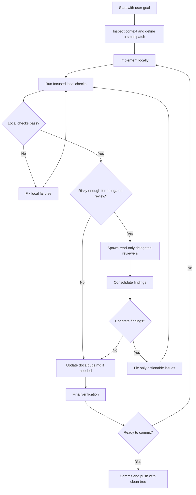

# Engineering Review Flow

This is the preferred loop for changes where correctness matters more than raw
speed. The goal is to keep the main session responsible for implementation and
use delegated reviewers as a late risk filter.

## Rules

- Implement first, review second. Delegate after the patch is coherent and local
  checks pass.
- Use delegated review for security, persistence, cross-platform behavior,
  protocol/API changes, concurrency, and agent/delegation infrastructure.
- Skip delegation for small docs-only edits, UI copy, mechanical formatting, and
  obvious test-only patches unless explicitly requested.
- Treat delegate output as evidence, not orders. Fix concrete correctness issues;
  record real remaining gaps in `docs/bugs.md`; ignore cosmetic notes unless they
  materially improve maintainability.
- If a delegate finding changes code, loop back through focused local checks
  before committing.
- Commit only from a clean, verified tree.
